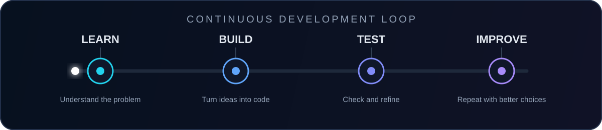

<p align="center">
  
</p>

<p align="center">
  <a href="https://github.com/safayet-abir">
    
  </a>
  <a href="mailto:safayetabir0@gmail.com">
    
  </a>
  
</p>

## 👨‍💻 About Me

I am a Computer Science student and aspiring Software Engineer who enjoys turning ideas into useful, well-structured software.

- 🌱 Strengthening **Data Structures, Algorithms, and problem-solving**
- 🛠️ Building projects from **idea to deployment**
- 🧪 Improving **code quality, testing, and documentation**
- 🎯 Preparing for **Software Engineering internship opportunities**
- 📫 Reach me at **[safayetabir0@gmail.com](mailto:safayetabir0@gmail.com)**

> **Career goal:** Grow through real engineering work, strong mentorship, and meaningful software projects.

## 🧰 Technology Toolkit

<p align="center">
  
</p>

<table align="center">
  <tr>
    <td><b>Languages</b></td>
    <td>Python, JavaScript, C, C++</td>
  </tr>
  <tr>
    <td><b>Web</b></td>
    <td>HTML, CSS</td>
  </tr>
  <tr>
    <td><b>Tools</b></td>
    <td>Git, GitHub, VS Code</td>
  </tr>
  <tr>
    <td><b>Currently learning</b></td>
    <td>Data Structures, Algorithms, Software Engineering practices</td>
  </tr>
</table>

## ⚡ My Development Loop

<p align="center">
  
</p>

## 📊 GitHub Insights

<p align="center">
  
  
</p>

## 🚀 Current Focus

```text
01  Solve more problems consistently
02  Build complete portfolio-ready projects
03  Write cleaner and more maintainable code
04  Learn deployment and collaborative development
```

## 🤝 Open To

- Software Engineering internships
- Beginner-friendly open-source collaboration
- Team projects and learning opportunities
- Constructive feedback and mentorship

## 📬 Connect

<p align="center">
  <a href="mailto:safayetabir0@gmail.com">
    
  </a>
  <a href="https://github.com/safayet-abir">
    
  </a>
</p>

<p align="center">
  <b>Small commits. Clear thinking. Better software.</b>
</p>

<!--
To add LinkedIn later, paste this beside the other Connect badges and replace YOUR-LINKEDIN-URL:

<a href="YOUR-LINKEDIN-URL">
  
</a>
-->
